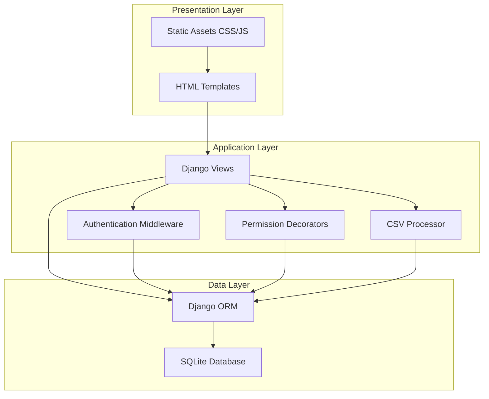
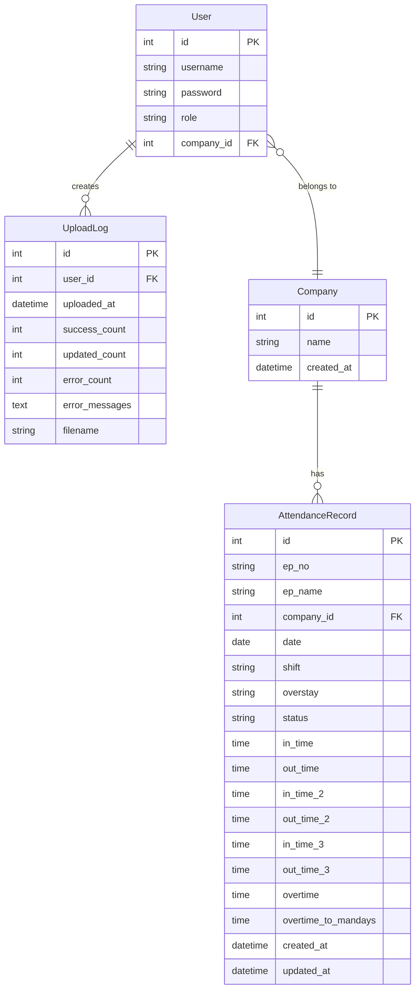

# Design Document

## Overview

The Attendance Management System is a Django-based web application that provides role-based attendance data management with CSV import/export capabilities. The system follows Django's MVT (Model-View-Template) architecture and implements a three-tier permission model (Root, Admin, User1) with company-based data isolation.

## Architecture

### High-Level Architecture



### Application Structure

```
attendance_system/
├── attendance_system/          # Django project configuration
│   ├── settings.py            # Project settings
│   ├── urls.py                # Root URL configuration
│   └── wsgi.py                # WSGI application
├── core/                      # Main application
│   ├── models.py              # Data models
│   ├── views.py               # View functions
│   ├── urls.py                # App URL routing
│   ├── admin.py               # Admin configuration
│   ├── forms.py               # Form definitions
│   ├── decorators.py          # Permission decorators
│   ├── csv_processor.py       # CSV validation and processing
│   ├── templates/             # HTML templates
│   │   ├── base.html
│   │   ├── login.html
│   │   ├── dashboard.html
│   │   ├── upload.html
│   │   ├── attendance_list.html
│   │   ├── attendance_edit.html
│   │   ├── user_management.html
│   │   └── upload_logs.html
│   └── static/                # CSS, JavaScript
│       ├── css/
│       └── js/
├── db.sqlite3                 # SQLite database
└── manage.py                  # Django management script
```

## Components and Interfaces

### 1. Data Models

#### User Model (Extended from Django AbstractUser)
```python
class User(AbstractUser):
    role = CharField(choices=['root', 'admin', 'user1'])
    company = ForeignKey('Company', null=True, blank=True)
```

**Relationships:**
- One-to-Many with Company (optional for Root users)
- One-to-Many with UploadLog

#### Company Model
```python
class Company:
    name = CharField(max_length=255, unique=True)
    created_at = DateTimeField(auto_now_add=True)
```

**Relationships:**
- One-to-Many with User
- One-to-Many with AttendanceRecord

#### AttendanceRecord Model
```python
class AttendanceRecord:
    ep_no = CharField(max_length=50)
    ep_name = CharField(max_length=255)
    company = ForeignKey('Company')
    date = DateField()
    shift = CharField(max_length=50)
    overstay = CharField(max_length=50)
    status = CharField(choices=['P', 'A', 'PH', '-0.5', '-1'])
    in_time = TimeField(null=True, blank=True)
    out_time = TimeField(null=True, blank=True)
    in_time_2 = TimeField(null=True, blank=True)
    out_time_2 = TimeField(null=True, blank=True)
    in_time_3 = TimeField(null=True, blank=True)
    out_time_3 = TimeField(null=True, blank=True)
    overtime = TimeField(null=True, blank=True)
    overtime_to_mandays = TimeField(null=True, blank=True)
    created_at = DateTimeField(auto_now_add=True)
    updated_at = DateTimeField(auto_now=True)
    
    class Meta:
        unique_together = ['ep_no', 'date']
```

**Relationships:**
- Many-to-One with Company

#### UploadLog Model
```python
class UploadLog:
    user = ForeignKey('User')
    uploaded_at = DateTimeField(auto_now_add=True)
    success_count = IntegerField(default=0)
    updated_count = IntegerField(default=0)
    error_count = IntegerField(default=0)
    error_messages = TextField(blank=True)
    filename = CharField(max_length=255)
```

**Relationships:**
- Many-to-One with User

### 2. Permission System

#### Permission Decorators

```python
@login_required
def role_required(allowed_roles):
    """Decorator to restrict access based on user role"""
    
@login_required
def company_access_required(view_func):
    """Decorator to ensure users can only access their company data"""
```

#### Permission Matrix

| Action | Root | Admin | User1 |
|--------|------|-------|-------|
| Upload CSV | All companies | Own company only | Denied |
| View Records | All companies | Own company only | Own company only |
| Edit Records | All companies | Own company only | Denied |
| Delete Records | All companies | Own company only | Denied |
| Create Users | All roles | User1 only | Denied |
| Manage Users | All users | User1 in own company | Denied |
| View Upload Logs | All logs | Own company logs | Denied |
| Export Data | All companies | Own company only | Own company only |
| Admin Panel | Full access | Denied | Denied |

### 3. CSV Processing Component

#### CSVProcessor Class

```python
class CSVProcessor:
    REQUIRED_FIELDS = ['EP NO', 'EP NAME', 'COMPANY NAME', 'DATE', 
                       'SHIFT', 'OVERSTAY', 'STATUS']
    OPTIONAL_FIELDS = ['IN', 'OUT', 'IN (2)', 'OUT (2)', 'IN (3)', 
                       'OUT (3)', 'OVERTIME', 'OVERTIME TO MANDAYS']
    VALID_STATUS = ['P', 'A', 'PH', '-0.5', '-1']
    
    def validate_csv(self, file) -> dict
    def process_row(self, row, user) -> tuple
    def validate_date(self, date_str) -> date
    def validate_time(self, time_str) -> time
    def validate_status(self, status) -> bool
    def create_or_update_record(self, data) -> tuple
```

**Methods:**
- `validate_csv()`: Validates CSV structure and headers
- `process_row()`: Processes individual CSV row with validation
- `validate_date()`: Validates date format and ensures not future date
- `validate_time()`: Validates time format (HH:MM)
- `validate_status()`: Validates status against allowed values
- `create_or_update_record()`: Creates new or updates existing attendance record

### 4. View Components

#### Authentication Views
- `login_view()`: Handles user authentication
- `logout_view()`: Handles user logout

#### Dashboard Views
- `dashboard_view()`: Main dashboard with summary statistics
- `attendance_list_view()`: Paginated list of attendance records with filters
- `attendance_edit_view()`: Edit individual attendance record
- `attendance_delete_view()`: Delete attendance record

#### Upload Views
- `upload_csv_view()`: Handle CSV file upload and processing
- `upload_logs_view()`: Display upload history and logs

#### User Management Views
- `user_list_view()`: List all users (filtered by permission)
- `user_create_view()`: Create new user
- `user_edit_view()`: Edit existing user
- `user_delete_view()`: Delete user

#### Export Views
- `export_csv_view()`: Generate and download CSV export

### 5. Template Structure

#### Base Template (base.html)
- Navigation bar with role-based menu items
- User info display
- Logout button
- Flash message display
- Content block

#### Dashboard Template (dashboard.html)
- Summary cards (total records, companies, recent uploads)
- Quick action buttons
- Recent activity feed

#### Upload Template (upload.html)
- File upload form
- CSV format instructions
- Sample CSV download link
- Upload history table

#### Attendance List Template (attendance_list.html)
- Filter form (date range, company, employee, status)
- Sortable data table
- Pagination controls
- Edit/Delete action buttons (role-based)
- Export button

## Data Models

### Entity Relationship Diagram



### Database Indexes

```python
# AttendanceRecord indexes
indexes = [
    Index(fields=['ep_no', 'date']),  # Unique constraint
    Index(fields=['company', 'date']),  # Filter by company and date
    Index(fields=['date']),  # Date range queries
]

# UploadLog indexes
indexes = [
    Index(fields=['user', 'uploaded_at']),  # User upload history
    Index(fields=['uploaded_at']),  # Recent uploads
]
```

## Error Handling

### Validation Errors

**CSV Upload Errors:**
- Missing required fields → Return error with missing field names
- Invalid date format → Return error with row number and invalid value
- Future date → Return error with row number
- Invalid time format → Return error with row number and field name
- Invalid status value → Return error with row number and invalid value
- Company mismatch (Admin) → Return authorization error

**Form Validation Errors:**
- Empty required fields → Display field-level error messages
- Invalid data types → Display field-level error messages
- Duplicate username → Display error message

### Authorization Errors

**Permission Denied:**
- User1 attempting upload → Redirect to dashboard with error message
- Admin accessing other company data → Return 403 Forbidden
- Non-root accessing admin panel → Return 403 Forbidden
- User1 attempting edit/delete → Return 403 Forbidden

### System Errors

**Database Errors:**
- Connection failure → Display generic error message, log details
- Constraint violation → Display user-friendly error message
- Transaction failure → Rollback and display error message

**File Processing Errors:**
- File too large → Display size limit error
- Invalid file format → Display format error
- Encoding issues → Attempt UTF-8, fallback to latin-1, display error if both fail

### Error Response Format

```python
# JSON API responses
{
    "success": false,
    "error": "Error message",
    "details": {
        "field": "Specific field error"
    }
}

# Template context
{
    "messages": [
        {"level": "error", "text": "Error message"}
    ]
}
```

## Testing Strategy

### Unit Tests

**Model Tests:**
- User model role validation
- AttendanceRecord unique constraint enforcement
- Company name uniqueness
- Model field validation

**CSV Processor Tests:**
- Date validation (valid, invalid format, future date)
- Time validation (valid, invalid format, null values)
- Status validation (valid values, invalid values)
- Row processing (success, validation errors)
- Duplicate handling (create vs update)

**Permission Decorator Tests:**
- Role-based access control
- Company-based data filtering
- Unauthorized access rejection

### Integration Tests

**Upload Flow Tests:**
- Root user uploads CSV for multiple companies
- Admin user uploads CSV for own company
- Admin user attempts upload for different company (should fail)
- User1 attempts upload (should fail)
- CSV with validation errors
- CSV with duplicate records

**Data Management Tests:**
- Root user views all company data
- Admin user views only own company data
- User1 views only own company data
- Edit/delete permission enforcement
- Filter and search functionality

**User Management Tests:**
- Root creates users with all roles
- Admin creates User1 for own company
- Admin attempts to create Admin (should fail)
- User1 attempts to create user (should fail)

**Export Tests:**
- Export with filters applied
- Export respects company access restrictions
- Export format matches upload format

### End-to-End Tests

**Complete User Workflows:**
1. Login → Upload CSV → View records → Edit record → Export data → Logout
2. Login as Admin → Create User1 → Logout → Login as User1 → View data
3. Upload CSV with errors → View upload log → Fix errors → Re-upload

### Test Data

**Fixtures:**
- 3 companies (Company A, Company B, Company C)
- 1 Root user
- 2 Admin users (one per company)
- 2 User1 users (one per company)
- 50 attendance records across companies
- Sample CSV files (valid, invalid formats, edge cases)

### Testing Tools

- Django TestCase for unit and integration tests
- Django Client for view testing
- Factory Boy for test data generation
- Coverage.py for code coverage reporting
- Target: 80%+ code coverage

## Security Considerations

### Authentication
- Django's built-in authentication system
- Password hashing with PBKDF2
- Session-based authentication
- CSRF protection on all forms

### Authorization
- Decorator-based permission checks on all views
- QuerySet filtering based on user company
- Admin panel restricted to Root users only

### Data Validation
- Server-side validation for all inputs
- SQL injection prevention via Django ORM
- File upload size limits
- CSV content validation before processing

### Audit Trail
- All uploads logged with user and timestamp
- Record creation and update timestamps
- Error logging for debugging

## Performance Considerations

### Database Optimization
- Indexes on frequently queried fields
- Bulk create/update for CSV processing
- Select_related/prefetch_related for foreign keys
- Pagination for large result sets

### File Processing
- Stream processing for large CSV files
- Batch database operations
- Progress feedback for long uploads
- File size limits to prevent memory issues

### Caching Strategy
- Cache company list (rarely changes)
- Cache user permissions (session-based)
- Static file caching with versioning
