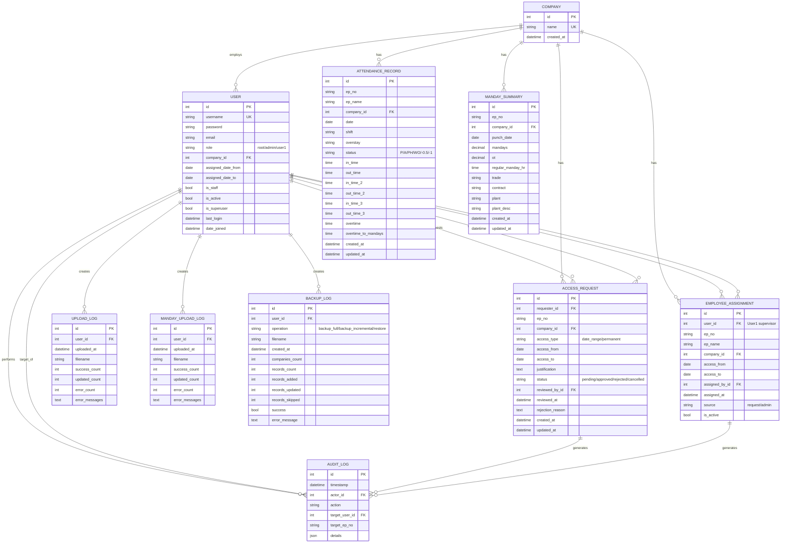
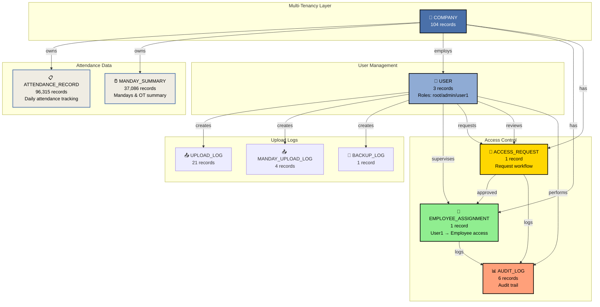
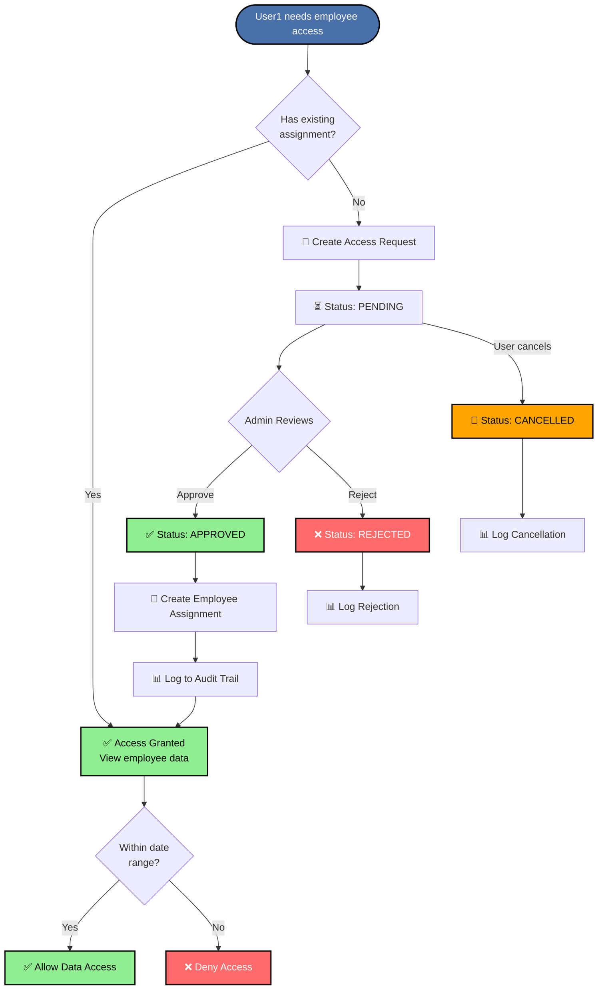
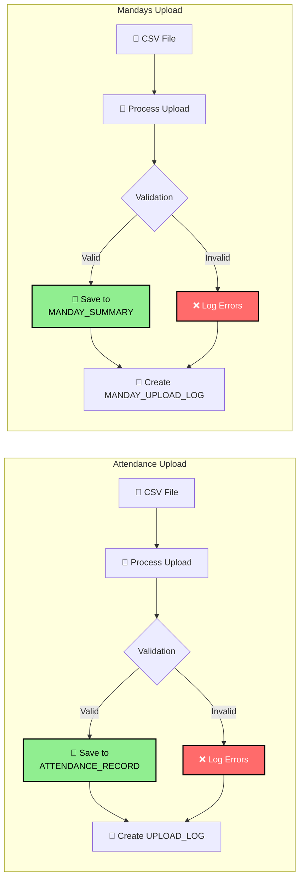
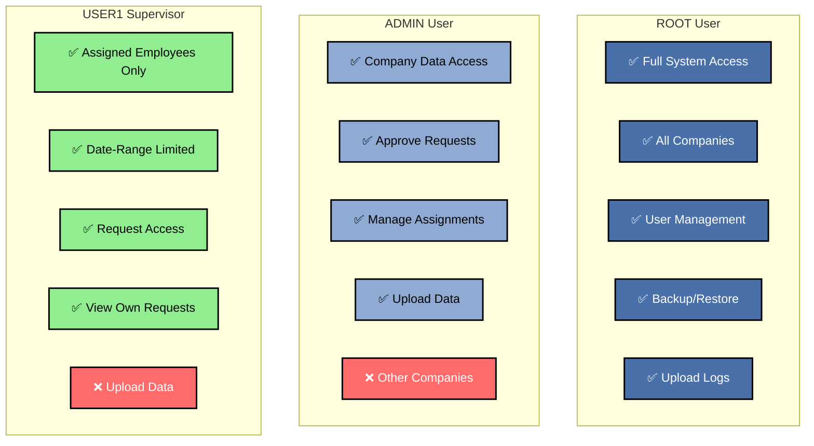
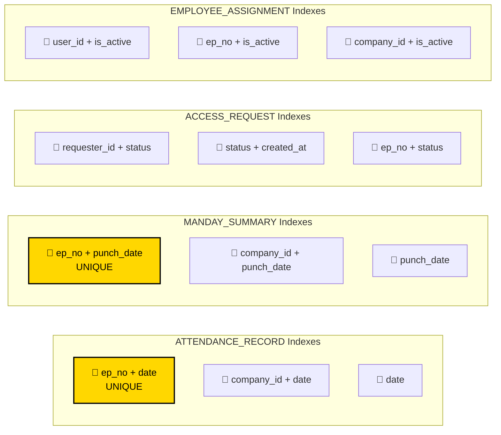

# 🗄️ Database Entity Relationship Diagram

## Complete ER Diagram - Attendance Management System



---

## Simplified View - Core Relationships



---

## Access Control Flow Diagram



---

## Data Upload Flow



---

## Role-Based Access Matrix



---

## Database Indexes Visualization



---

## Key Relationships Summary

### 1️⃣ **Multi-Tenancy (Company-Based)**
- Every data record belongs to a company
- Users are assigned to companies
- Data isolation enforced at query level

### 2️⃣ **User Roles & Permissions**
- **Root**: System-wide access
- **Admin**: Company-level access
- **User1**: Employee-level access (via assignments)

### 3️⃣ **Access Control Workflow**
```
User1 → Access Request → Admin Review → Approval → Employee Assignment → Data Access
```

### 4️⃣ **Data Upload Pipeline**
```
CSV File → Validation → Database Insert/Update → Upload Log → Audit Trail
```

### 5️⃣ **Audit Trail**
- All access requests logged
- All assignments tracked
- All administrative actions recorded

---

## Cardinality Legend

| Symbol | Meaning |
|--------|---------|
| `||--o{` | One-to-Many |
| `||--||` | One-to-One |
| `}o--o{` | Many-to-Many |
| `PK` | Primary Key |
| `FK` | Foreign Key |
| `UK` | Unique Key |

---

## Table Size Summary

| Table | Records | Growth Rate |
|-------|---------|-------------|
| 📋 ATTENDANCE_RECORD | 96,315 | High (daily) |
| ⏰ MANDAY_SUMMARY | 37,086 | High (daily) |
| 🏢 COMPANY | 104 | Low (stable) |
| 📤 UPLOAD_LOG | 21 | Medium (per upload) |
| 📤 MANDAY_UPLOAD_LOG | 4 | Medium (per upload) |
| 📊 AUDIT_LOG | 6 | Medium (per action) |
| 👤 USER | 3 | Low (stable) |
| 🔐 EMPLOYEE_ASSIGNMENT | 1 | Low (as needed) |
| 📝 ACCESS_REQUEST | 1 | Low (as needed) |
| 💾 BACKUP_LOG | 1 | Low (per backup) |

---

## Performance Considerations

### ✅ Optimized Queries
- Indexed on frequently queried columns
- Composite indexes for multi-column filters
- Unique constraints prevent duplicates

### ⚠️ Watch For
- Attendance table growing rapidly (96K+ records)
- Mandays table growing rapidly (37K+ records)
- Consider archiving old data periodically

### 🚀 Recommendations
1. Archive attendance data older than 2 years
2. Partition large tables by date
3. Regular VACUUM operations on SQLite
4. Consider PostgreSQL for production scale
